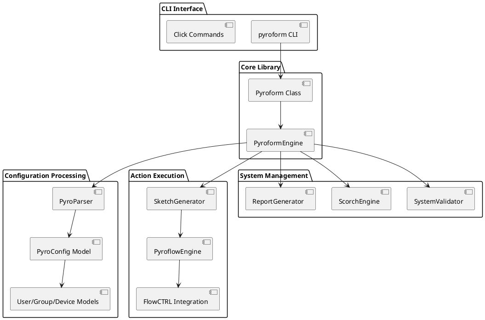
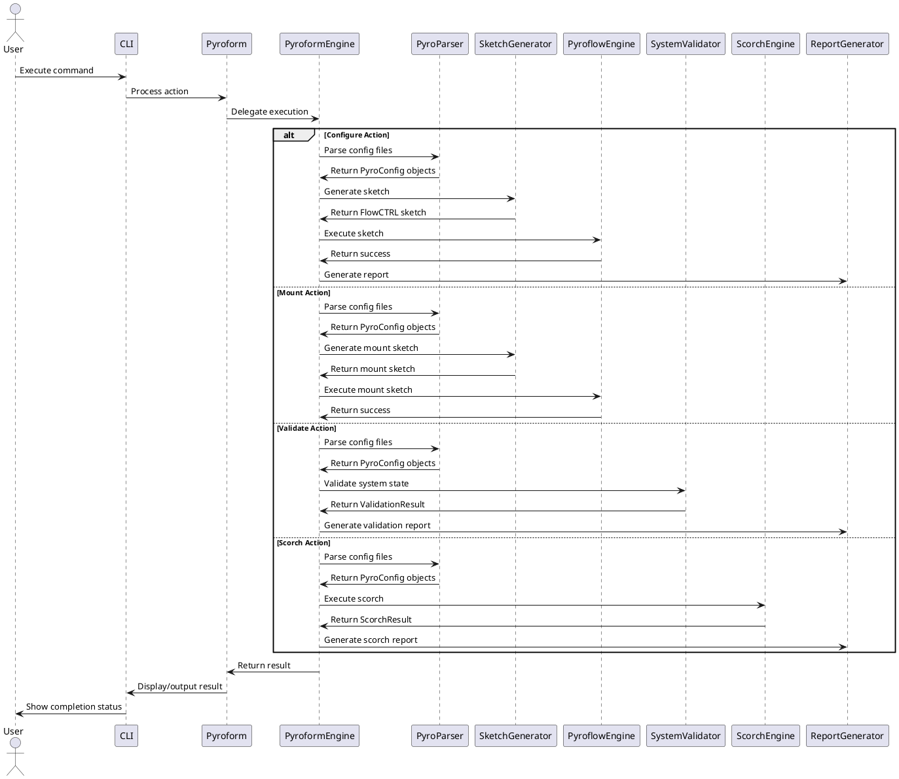

# Pyroform

### Overview

Pyroform is a Linux configuration management tool written in Python3 that transforms declarative configuration files into system-level changes. It receives input files containing users, groups, device mountpoints, files, and directories with owners and permissions, then generates and executes FlowCTRL sketch files to apply these configurations.

## Features

- Multi-format Configuration: Support for JSON and YAML configuration files
- Four Core Actions: Configure, Mount, Scorch (cleanup), and Validate
- Safety First: Built-in validation and safety checks with dry-run capability
- Comprehensive Reporting: Detailed execution reports and validation summaries
- Workflow Support: Execute complex multi-step workflows
- Programmatic API: Full Python library for integration
- Extensive Testing: Comprehensive unit and integration tests

## Actions

- **Configure**: creates users, groups, files and directories with appropriate ownership and permissions
- **Scorch**: Cleanup everything on the system not specified in the input Pyro file(s)
- **Mount**: mounts block storage device partitions to designated mountpoints
- **Validate**: No action, just reports if the system corresponds to input Pyro file(s)

## Architecture



## Component Interactions


## Installation

From Source
```bash
~$ git clone git@github.com:Del-Tango/Pyroform.git
~$ cd Pyroform
~$ ./build.sh --setup
~$ ./build.sh BUILD INSTALL
```

## Dependencies

- Python 3.8+
- Click (for CLI)
- PyYAML (for YAML support)
- FlowCTRL (for sketch execution)

## Configuration Files

### Pyroform Configuration (YAML)
```yaml
# pyroform_config.yaml
safety_checks: true
default_output_dir: "/tmp/pyroform"
log_level: "INFO"
auto_confirm: false
dry_run: false
```

### Pyro Examples

#### Basic User/Group Configuration (JSON)
```json
{
  "Label": "Basic Server Setup",
  "Users": [
    {
      "label": "app_user",
      "Name": "appuser",
      "Password": "securepassword123",
      "Groups": ["appgroup", "users"]
    },
    {
      "label": "data_user",
      "Name": "datauser",
      "Password": "datapassword456",
      "Groups": ["datagroup", "users"]
    }
  ],
  "Groups": [
    {
      "label": "app_group",
      "Name": "appgroup",
      "Users": ["appuser"]
    },
    {
      "label": "data_group",
      "Name": "datagroup",
      "Users": ["datauser"]
    },
    {
      "label": "users_group",
      "Name": "users",
      "Users": ["appuser", "datauser"]
    }
  ],
  "Devices": []
}
```

#### Advanced Configuration with Devices (YAML)
```yaml
# advanced_config.yaml
Label: "Production Server Configuration"
Users:
  - label: "web_user"
    Name: "webuser"
    Password: "webpass789"
    Groups: ["webgroup", "sudo"]

  - label: "db_user"
    Name: "dbuser"
    Password: "dbpass321"
    Groups: ["dbgroup", "users"]

Groups:
  - label: "web_group"
    Name: "webgroup"
    Users: ["webuser"]

  - label: "db_group"
    Name: "dbgroup"
    Users: ["dbuser"]

  - label: "sudo_group"
    Name: "sudo"
    Users: ["webuser"]

Devices:
  - label: "data_disk"
    Path: "/dev/sdb1"
    Partition: 1
    Mountpoint: "/mnt/data"
    State:
      - "dir,/mnt/data/web,webuser,webgroup,755"
      - "dir,/mnt/data/db,dbuser,dbgroup,750"
      - "fl,/mnt/data/web/config.json,webuser,webgroup,644"
      - "fl,/mnt/data/db/credentials.conf,dbuser,dbgroup,600"

  - label: "backup_disk"
    Path: "/dev/sdc1"
    Partition: 1
    Mountpoint: "/mnt/backup"
    State:
      - "dir,/mnt/backup/daily,root,root,755"
      - "dir,/mnt/backup/weekly,root,root,755"
```

#### Workflow Configuration
```yaml
# workflow_config.yaml
name: "Full Server Deployment"
description: "Complete server setup and validation workflow"
auto_confirm: true
config_file: "/etc/pyroform/config.yaml"
generate_report: true
report_file: "/var/log/pyroform/deployment_report.json"

steps:
  - action: "validate"
    input_path: "/etc/pyroform/production_config.yaml"
    description: "Validate current system state"

  - action: "configure"
    input_path: "/etc/pyroform/production_config.yaml"
    description: "Configure users and groups"
    dry_run: false

  - action: "mount"
    input_path: "/etc/pyroform/production_config.yaml"
    description: "Mount storage devices"

  - action: "validate"
    input_path: "/etc/pyroform/production_config.yaml"
    description: "Verify final system state"
```

## Usage Examples

### Command Line Interface

#### Basic Configuration
```bash
# Configure system from single file
~$ pyroform -C -i /path/to/config.yaml -y

# Configure from directory of config files
~$ pyroform -C -i /etc/pyroform/configs/ -y -r

# Dry run to see what would be changed
~$ pyroform -C -i config.yaml --dry-run

# With custom config and output
~$ pyroform -C -i config.yaml -c pyroform_config.yaml -o /tmp/output/ -y
```

#### Mount Operations
```bash
# Mount devices only
~$ pyroform -M -i storage_config.yaml -y

# Mount with validation
~$ pyroform -M -i storage_config.yaml -V -i storage_config.yaml -y
```

#### System Validation
```bash
# Validate system against configuration
~$ pyroform -V -i desired_config.yaml

# Validate with detailed report
~$ pyroform -V -i desired_config.yaml -r -o validation_report.json
```

#### Scorch (Cleanup) Operations
```bash
# Dry run scorch (see what would be removed)
~$ pyroform -S -i config.yaml --dry-run

# Execute scorch with confirmation
~$ pyroform  -S -i config.yaml

# Auto-confirm scorch (dangerous!)
~$ pyroform -S -i config.yaml -y
```

#### Workflow Execution
```bash
# Execute complete workflow
~$ pyroform workflow -w deployment_workflow.yaml

# Execute workflow with debug output
~$ pyroform workflow -w deployment_workflow.yaml -d
```

#### Getting Help and Version
```bash
# Show help
~$ pyroform --help

# Show version
~$ pyroform --version
```

## Python Library Usage

### Basic Programmatic Usage
```python
from pyroform import Pyroform

# Initialize with auto-confirm for scripts
pf = Pyroform(auto_confirm=True)

# Configure system
success = pf.configure("/path/to/config.yaml")
print(f"Configure action: {'Success' if success else 'Failed'}")

# Validate system state
validation_result = pf.validate("/path/to/config.yaml")
print(f"System valid: {validation_result.is_valid}")
if not validation_result.is_valid:
    for issue in validation_result.discrepancies:
        print(f"  - {issue['type']}: {issue['issue']}")

# Generate report
pf.generate_report("/path/to/report.json")
```

### Advanced Workflow Execution
```python
from pyroform import Pyroform

def deploy_server():
    pf = Pyroform(
        config_file="/etc/pyroform/config.yaml",
        auto_confirm=True
    )

    # Define workflow steps
    workflow = [
        {
            "action": "validate",
            "input_path": "/etc/pyroform/production.yaml",
            "description": "Pre-deployment validation"
        },
        {
            "action": "configure",
            "input_path": "/etc/pyroform/production.yaml",
            "description": "User and group configuration"
        },
        {
            "action": "mount",
            "input_path": "/etc/pyroform/production.yaml",
            "description": "Storage mounting"
        },
        {
            "action": "validate",
            "input_path": "/etc/pyroform/production.yaml",
            "description": "Post-deployment verification"
        }
    ]

    # Execute workflow
    success = pf.execute_workflow(workflow)

    if success:
        print("Deployment completed successfully")
        pf.generate_report("/var/log/pyroform/deployment_report.json")
    else:
        print("Deployment failed")
        return False

    return True

if __name__ == "__main__":
    deploy_server()
```

### Error Handling and Recovery
```python
from pyroform import Pyroform
import time

def robust_configure(max_retries=3):
    pf = Pyroform(auto_confirm=True)

    for attempt in range(max_retries):
        try:
            print(f"Configuration attempt {attempt + 1}")

            # Validate first
            validation = pf.validate("/path/to/config.yaml")
            if not validation.is_valid:
                print("Configuration validation failed:")
                for issue in validation.discrepancies:
                    print(f"  - {issue}")

                if attempt == max_retries - 1:
                    return False

            # Execute configuration
            success = pf.configure("/path/to/config.yaml")

            if success:
                print("Configuration successful")
                pf.generate_report("/path/to/success_report.json")
                return True
            else:
                print("Configuration failed, retrying...")
                time.sleep(2)  # Wait before retry

        except Exception as e:
            print(f"Error during configuration: {e}")
            if attempt == max_retries - 1:
                return False
            time.sleep(2)

    return False
```

## State Management and Safety

### Dry Run Mode

Always test with dry-run mode first:
```bash
# Safe preview of changes
~$ pyroform -C -i config.yaml --dry-run -r

# Preview scorch operations
~$ pyroform -S -i config.yaml --dry-run -r
```

### Validation Workflow
```bash
# 1. Validate current state
~$ pyroform -V -i desired_state.yaml -o pre_validation.json

# 2. Preview changes (dry run)
~$ pyroform -C -i desired_state.yaml --dry-run -r

# 3. Apply changes
~$ pyroform -C -i desired_state.yaml -y -r

# 4. Validate final state
~$ pyroform -V -i desired_state.yaml -o post_validation.json
```

### Report Generation

Pyroform generates comprehensive JSON reports for all actions:

#### Report Structure
```json
{
  "action": "configure",
  "timestamp": "2024-01-15T10:30:00",
  "duration_seconds": 45.2,
  "success": true,
  "config_files": ["/path/to/config.yaml"],
  "summary": {
    "action_type": "configure",
    "status": "success",
    "resources_processed": 15,
    "errors": 0
  },
  "details": {
    "users_created": ["appuser", "datauser"],
    "groups_created": ["appgroup", "datagroup"],
    "devices_mounted": ["/dev/sdb1"]
  }
}
```

## Best Practices

- Always use dry-run first to preview changes
- Version control your configuration files
- Use validation before and after changes
- Generate and store reports for audit trails
- Test in non-production environments first
- Use workflow files for complex deployments
- Implement proper error handling in scripts

## Troubleshooting

### Common Issues

- Permission Denied: Run with appropriate privileges
- Invalid Configuration: Use validation to identify issues
- Missing Dependencies: Ensure FlowCTRL is installed
- Dry-run vs Actual: Always verify with dry-run first

### Debug Mode

Enable debug mode for detailed logging:
```bash
~$ pyroform -C -i config.yaml -d -l /var/log/pyroform/debug.log
```

## Development
Running Tests
```bash
# Unit tests
~$ python -m unittest discover pyroform/tst/unit/

# Integration tests
~$ python -m pytest pyroform/tst/integration/ -v

# Integration tests with coverage
~$ python -m pytest pyroform/tst/integration/ -v --cov=pyroform
```
