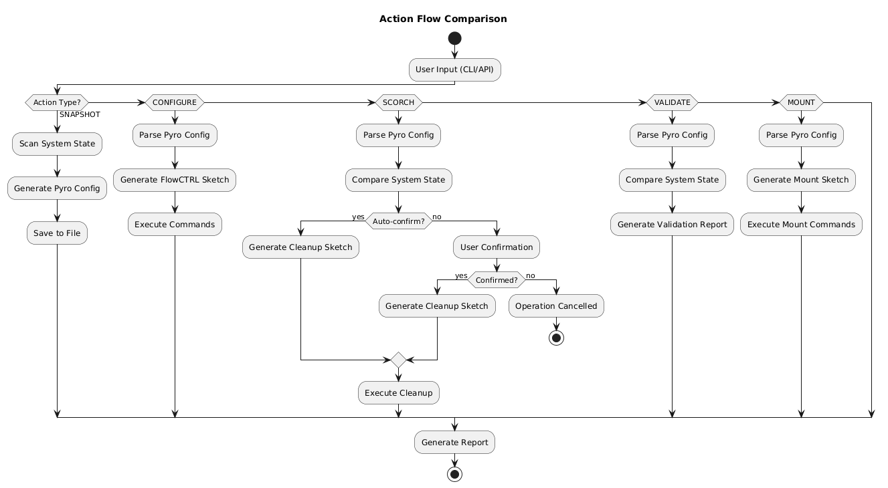
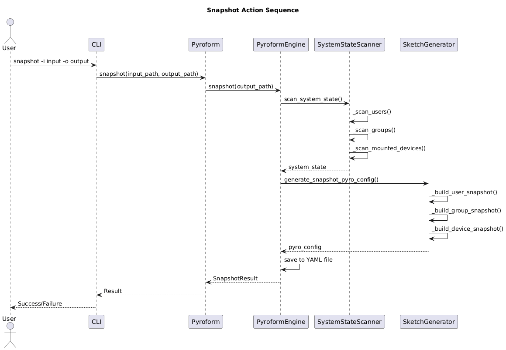
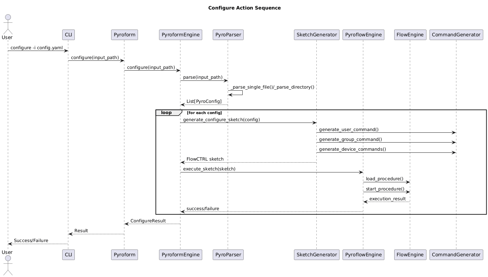
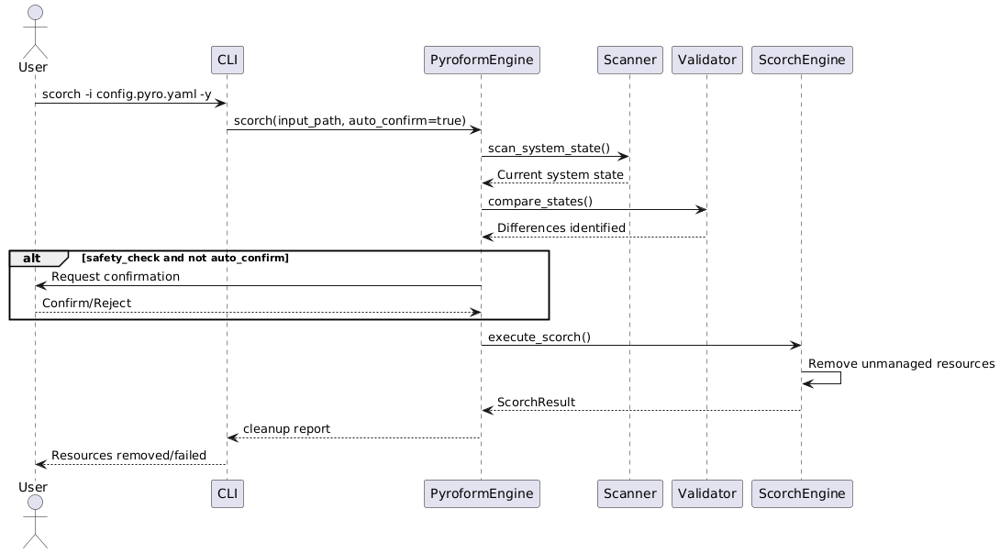
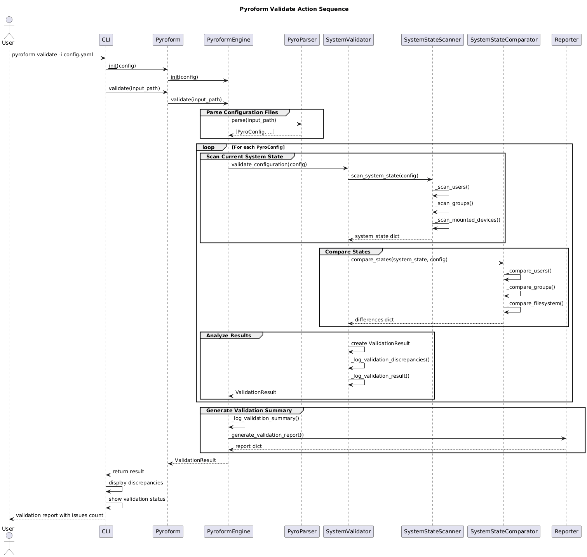
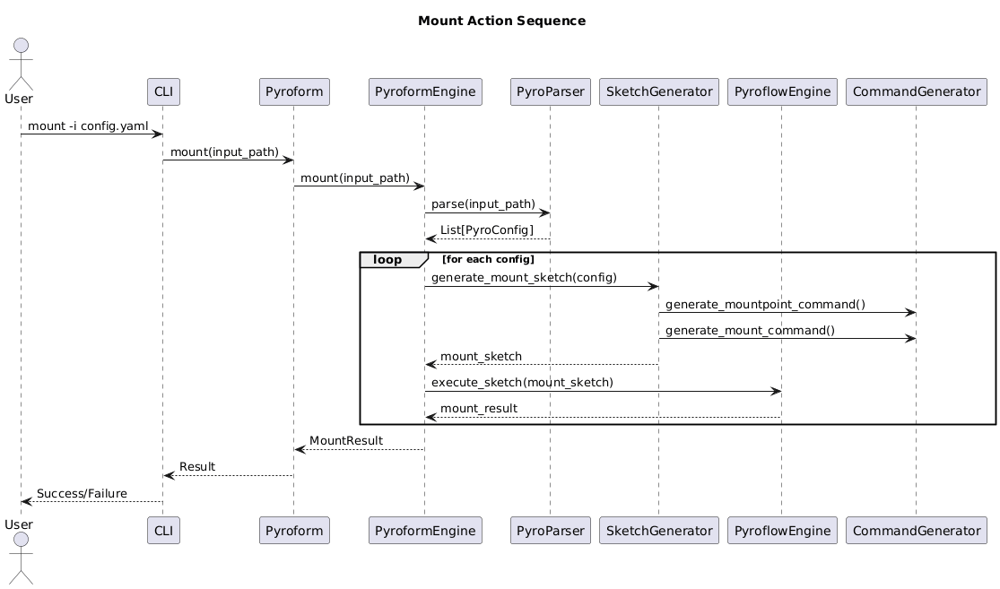
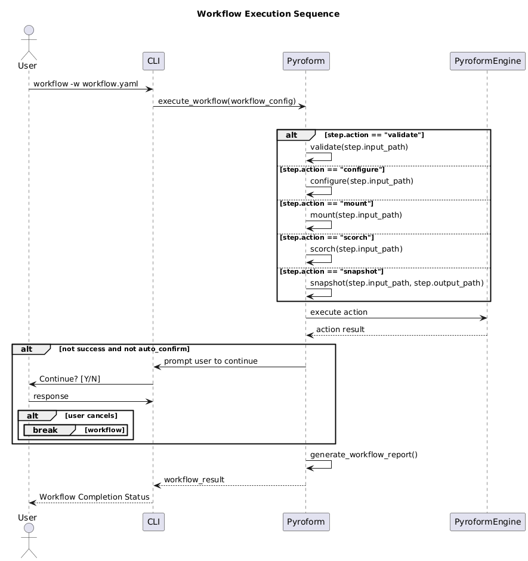
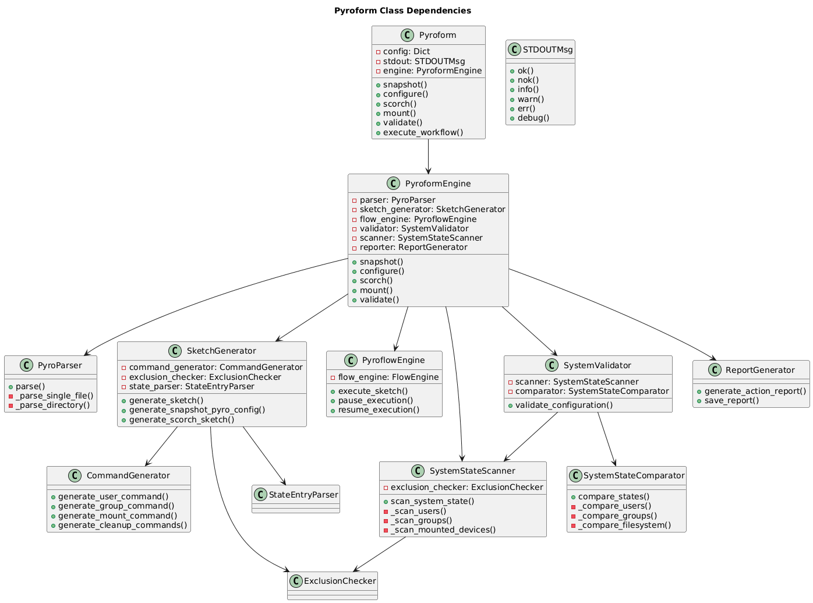
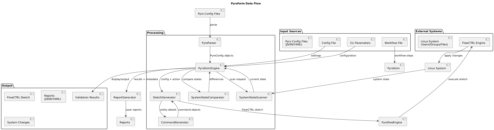

# Pyroform - Linux Configuration Management Tool

## Overview

**Pyroform** is a Python-based Linux configuration management tool that processes declarative configuration files to manage system resources including users, groups, block storage device mountpoints, files, and directories with specific owners and permissions. It generates FlowCTRL sketch files on-the-fly and executes them using the [`flow_ctrl`](https://github.com/Del-Tango/FlowCTRL-Automation) library for reliable system management.

### Key Features
- **Declarative Configuration**: Define system state using JSON/YAML files
- **Resource Management**: Handle users, groups, filesystems, and mounts
- **Validation Engine**: Compare current system state with desired configuration
- **Destructive Operations**: Safe cleanup of unmanaged resources (scorch)
- **Snapshot Capability**: Capture current system state as configuration
- **Workflow Automation**: Multi-step execution sequences
- **Reporting**: Generate detailed action reports
- **Dry-run Mode**: Preview changes without execution

### CLI Toolin
```text
    ___________________________________________________________________________

      *                          *   Pyroform   *                           *
    ___________________________________________________________________________
                    Regards, the Alveare Solutions #!/Society -x

Usage: pyroform [OPTIONS] COMMAND [ARGS]...

  Pyroform: The Configurator That Actually Listens

  Ever tried describing your perfect Linux system setup only to have
  configuration tools nod politely and do their own thing? Pyroform actually
  pays attention and translates your vision through intelligent FlowCTRL
  sketch generation.

  Think of it as the diplomatic envoy between your declarative intentions and
  your system's current state. No more shouting commands into the void —
  Pyroform ensures your specifications are heard, interpreted and executed.

Options:
  --version  Display Pyroform version
  --help     Show this message and exit.

Commands:
  configure  Configure system according to Pyro file(s)
  mount      Mount devices according to Pyro file(s)
  scorch     Remove system resources not specified in Pyro file(s)
  snapshot   Generate Pyro file based on current system state
  validate   Validate system against Pyro file(s)
  workflow   Execute a complete Pyroform workflow from configuration file

```

## Use Cases

### 1. **System Provisioning & Deployment**
```bash
# Deploy a complete application stack with users, groups, and filesystem structure
~$ pyroform configure -i deployment.pyro.yaml -y --debug
```

### 2. Configuration Drift Detection & Remediation
```bash
# Detect configuration drift
~$ pyroform validate -i gold_config.pyro.yaml -r

# Apply corrective changes
~$ pyroform configure -i gold_config.pyro.yaml -y
```

### 3. Environment Cleanup
```bash
# Remove orphaned resources safely
~$ pyroform scorch -i baseline.pyro.yaml --dry-run  # Preview
~$ pyroform scorch -i baseline.pyro.yaml -y         # Execute
```

### 4. Disaster Recovery & Replication
```bash
# Capture system state
~$ pyroform snapshot -o system_snapshot.pyro.yaml

# Restore to another system
~$ pyroform configure -i system_snapshot.pyro.yaml -y
```

### 5. Multi-Step Workflows
```yaml
# workflow.pyro.yaml
steps:
  - action: validate
    input_path: config.pyro.json
  - action: configure
    input_path: config.pyro.json
  - action: mount
    input_path: storage.pyro.yaml
  - action: validate
    input_path: final_check.pyro.yaml
```

```bash
~$ pyroform workflow -w workflow.pyro.yaml
```

## Project Setup & Installation

### Prerequisites
- Python 3.8+
- Linux system
- Administrative privileges (for most operations)
- `flow_ctrl` library dependency

### Installation

#### From Source
```bash
# Clone the repository
~$ git clone https://github.com/Del-Tango/Pyroform.git
~$ cd Pyroform

# Install in development mode with Python virtual environment
~$ ./build.sh --setup --development && ./build.sh BUILD INSTALL

# Or install globally
~$ ./build.sh --setup && ./build.sh BUILD INSTALL
```

## Configuration File Setup

Create a configuration file (pyroform_config.yaml):
```yaml
# Global settings
safety_checks: true
default_output_dir: "/tmp/pyroform"
log_level: "INFO"
auto_confirm: false
dry_run: false

# FlowCTRL integration
flowctrl:
  log_dir: "log/pyroflow"
  debug: true
  continue_on_failure: false
```

## Architecture High Level Overview

### Action Flow Comparison


### Action Snapshot Sequence


### Action Configure Sequence


### Action Scorch Sequence


### Action Validate Sequence


### Action Mount Sequence


### Action Workflow Sequence


### Class Dependencies


### Data Flow


## Configuration File Formats
### Pyro Configuration (JSON/YAML) - config.pyro.yaml
```yaml
Label: "Web Server Configuration"
Users:
  - label: "Web Application User"
    Name: "webapp"
    Password: "$6$securehash"
    Groups: ["www-data", "appusers"]

Groups:
  - label: "Application Users Group"
    Name: "appusers"
    Users: ["webapp", "deployer"]

Devices:
  - label: "Data Volume"
    Path: "/dev/sdb"
    Partition: 1
    Mountpoint: "/data"
    State:
      - "dir,/data/logs,root,root,0755"
      - "dir,/data/uploads,webapp,www-data,0770"
      - "fl,/data/config.json,webapp,www-data,0640"
      - "ln,/mnt/data/app/logs,webapp,www-data,0770,/mnt/data/logs/app"

Excludes:
  Users: ["root", "daemon"]
  Groups: ["root", "daemon"]
  Devices: ["/dev/sda1"]
  Directories: ["/tmp", "/var/tmp"]
  Files: ["*.tmp", "*.log"]
  Links: []
```

### Workflow Configuration - workflow.pyro.yaml
```yaml
name: "Deployment Workflow"
config_file: "pyroform_config.yaml"
auto_confirm: true
generate_report: true
report_file: "deployment_report.json"

steps:
  - action: "validate"
    input_path: "config.yaml"
    description: "Validate initial state"

  - action: "configure"
    input_path: "config.yaml"
    description: "Apply base configuration"

  - action: "mount"
    input_path: "storage.yaml"
    description: "Mount storage devices"

  - action: "validate"
    input_path: "final.yaml"
    description: "Verify final state"

  - action: "scorch"
    input_path: "baseline.yaml"
    dry_run: false
    description: "Cleanup unmanaged resources"
```

### Basic Pyro File Structure
```yaml
Label: "Configuration Name"
Users: []
Groups: []
Devices: []
Excludes: {}
```

### Example Pyro User Configuration
```yaml
Users:
  - label: "User Description"
    Name: "username"
    Password: "password"
    Groups: ["group1", "group2"]
```

### Example Pyro Group Configuration
```yaml
Groups:
  - label: "Group Description"
    Name: "groupname"
    Users: ["user1", "user2"]
```

### Example Pyro Device & FileSystem Configuration
```yaml
Devices:
  - label: "Device Description"
    Path: "/dev/sdX"            # Block device
    Partition: 1                # Partition number (0 for whole device)
    Mountpoint: "/mount/path"
    State:                      # Filesystem structure
      - "dir,/path/to/dir,owner,group,permissions"
      - "fl,/path/to/file,owner,group,permissions"
      - "ln,/path/to/link,owner,group,permissions,target"
```

### Example Pyro Exclusion Rules
```yaml
Excludes:
  Users: ["root", "nobody"]
  Groups: ["root", "nogroup"]
  Devices: ["/dev/loop*", "/dev/sr0"]
  Directories: ["/tmp", "/proc", "/sys"]
  Files: ["*.log", "*.tmp"]
  Links: ["broken_link"]
```

## Command Line Interface
### Basic Commands
```bash
# Display help
~$ pyroform --help

# Display version
~$ pyroform --version

# Configure system
~$ pyroform configure -i config.pyro.yaml -y --debug

# Validate configuration
~$ pyroform validate -i config.pyro.yaml -r

# Mount devices
~$ pyroform mount -i storage.pyro.yaml

# Cleanup resources
~$ pyroform scorch -i baseline.pyro.yaml --dry-run

# Create snapshot
~$ pyroform snapshot -o snapshot.pyro.yaml

# Execute workflow
~$ pyroform workflow -w deployment.pyro.yaml
```

### Advanced Options
```bash
# Full configure command with all options
~$ pyroform configure \
  -i /path/to/configs \
  -o /tmp/output \
  -c pyroform_config.yaml \
  -l /var/log/pyroform.log \
  -r \
  -d \
  -y \
  --dry-run

# Generate validation report
~$ pyroform validate \
  -i baseline.json \
  -o reports/ \
  -r \
  --dump-report
```

## API Usage Examples
### Programmatic Usage
```python
from pyroform import Pyroform

# Initialize with configuration
pf = Pyroform(
    config_file="pyroform_config.yaml",
    auto_confirm=True,
    debug=False
)

# Validate system state
validation = pf.validate("/path/to/config.yaml")
if not validation.is_valid:
    print(f"Validation failed: {validation.discrepancies}")

# Apply configuration
success = pf.configure("/path/to/config.yaml")
if success:
    print("Configuration applied successfully")

# Execute scorch
result = pf.scorch("/path/to/baseline.yaml", dry_run=True)
print(f"Resources to remove: {result.resources_removed}")

# Generate report
pf.generate_report("operation_report.json")
```

### Custom Workflow Execution
```python
from pyroform import Pyroform

# Define workflow steps
workflow_steps = [
    {
        "action": "validate",
        "input_path": "config.pyro.yaml",
        "dry_run": True
    },
    {
        "action": "configure",
        "input_path": "config.pyro.yaml",
        "dry_run": False
    },
    {
        "action": "mount",
        "input_path": "storage.pyro.yaml",
        "dry_run": False
    }
]

# Execute workflow
pf = Pyroform(auto_confirm=True)
success = pf.execute_workflow(workflow_steps)

if success:
    pf.generate_report("workflow_report.json")
```

## Testing
### Running Tests
``` bash
# Run all autotesters
~$ ./build --test

# Run all python autotesters
~$ python -m pytest pyroform/tst/ -v
```

## Safety Features
### Confirmation Prompts
```text
# Destructive operations require confirmation
[ WARNING ]: Scorch will remove system resources not specified in 'baseline'
[ WARNING ]: This is a DESTRUCTIVE operation that cannot be undone!

Are you sure about this? [Y/N]>
```
### Dry-run Mode
```bash
# Preview changes without execution
~$ pyroform configure -i config.pyro.yaml --dry-run
~$ pyroform scorch -i baseline.pyro.yaml --dry-run
```

### Pyro File Exclusion Lists
```yaml
# Protect critical system resources
Excludes:
  Users: ["root", "daemon", "sys", "bin"]
  Groups: ["root", "daemon", "sys", "adm"]
  Devices: ["/dev/sda", "/dev/sdb"]
  Directories: ["/", "/etc", "/bin", "/sbin", "/usr"]
  Files: ["/etc/passwd", "/etc/group", "/etc/shadow"]
```

## FAQ

- Q: Is Pyroform idempotent?
    - A: Yes! Running the same configuration multiple times produces the same result.

- Q: Can I use Pyroform on non-Linux systems?
    - A: Pyroform is specifically designed for Linux systems and uses Linux-specific APIs.

- Q: Can I rollback changes?
    - A: While Pyroform doesn't have built-in rollback, you can take snapshots before operations and use them to restore state.

- Q: How does Pyroform compare to Ansible/Puppet/Chef?
    - A: Pyroform focuses on declarative system state management with a simpler, file-based approach and native FlowCTRL integration.

## Known Issues

### Usability
- YAML snapshots cannot be directly used for actions configure/validate/scorch without manual intervention
- No bootstrap / plug(&)play setup script

### Observability
- STDOUT messages not yet standardized / in flux

### Reliability
- Linters, checkers and formatter configs not yet standardized

### Robustness
- Autotester suit incomplete
- TPS not fully executed


