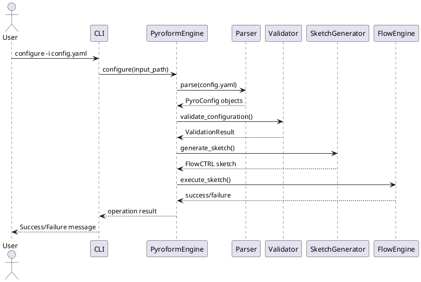
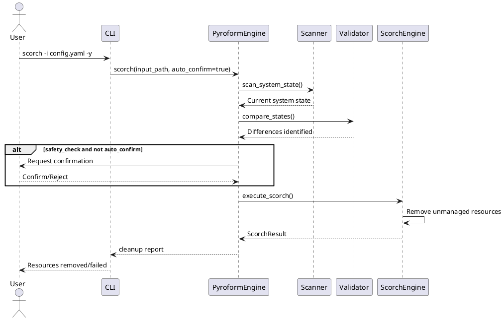
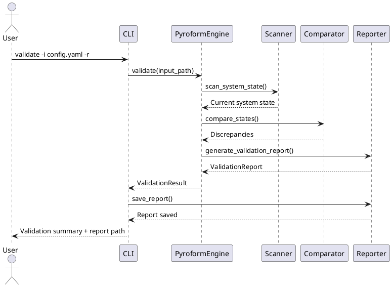

# Pyroform - Linux Configuration Management Tool

## Overview

**Pyroform** is a Python-based Linux configuration management tool that processes declarative configuration files to manage system resources including users, groups, block storage device mountpoints, files, and directories with specific owners and permissions. It generates FlowCTRL sketch files on-the-fly and executes them using the `flow_ctrl` library for reliable system management.

### Key Features
- **Declarative Configuration**: Define system state using JSON/YAML files
- **Resource Management**: Handle users, groups, filesystems, and mounts
- **Validation Engine**: Compare current system state with desired configuration
- **Destructive Operations**: Safe cleanup of unmanaged resources (scorch)
- **Snapshot Capability**: Capture current system state as configuration
- **Workflow Automation**: Multi-step execution sequences
- **Reporting**: Generate detailed action reports
- **Dry-run Mode**: Preview changes without execution

## Use Cases

### 1. **System Provisioning & Deployment**
```bash
# Deploy a complete application stack with users, groups, and filesystem structure
~$ pyroform configure -i deployment.pyro.yaml -y --debug
```

### 2. Configuration Drift Detection & Remediation
```bash
# Detect configuration drift
~$ pyroform validate -i gold_config.pyro.yaml -r

# Apply corrective changes
~$ pyroform configure -i gold_config.pyro.yaml -y
```

### 3. Environment Cleanup
```bash
# Remove orphaned resources safely
~$ pyroform scorch -i baseline.pyro.yaml --dry-run  # Preview
~$ pyroform scorch -i baseline.pyro.yaml -y         # Execute
```

### 4. Disaster Recovery & Replication
```bash
# Capture system state
~$ pyroform snapshot -o system_snapshot.pyro.yaml

# Restore to another system
~$ pyroform configure -i system_snapshot.pyro.yaml -y
```

### 5. Multi-Step Workflows
```yaml
# workflow.pyro.yaml
steps:
  - action: validate
    input_path: config.pyro.json
  - action: configure
    input_path: config.pyro.json
  - action: mount
    input_path: storage.pyro.yaml
  - action: validate
    input_path: final_check.pyro.yaml
```

```bash
~$ pyroform workflow -w workflow.pyro.yaml
```

## Project Setup & Installation

### Prerequisites
- Python 3.8+
- Linux system
- Administrative privileges (for most operations)
- `flow_ctrl` library dependency

### Installation

#### From Source
```bash
# Clone the repository
~$ git clone https://github.com/Del-Tango/Pyroform.git
~$ cd Pyroform

# Install in development mode with Python virtual environment
~$ ./build.sh --setup --development && ./build.sh BUILD INSTALL

# Or install globally
~$ ./build.sh --setup && ./build.sh BUILD INSTALL
```

## Configuration File Setup

Create a configuration file (pyroform_config.yaml):
```yaml
# Global settings
safety_checks: true
default_output_dir: "/tmp/pyroform"
log_level: "INFO"
auto_confirm: false
dry_run: false

# FlowCTRL integration
flowctrl:
  log_dir: "log/pyroflow"
  debug: true
  continue_on_failure: false
```

## Architecture Sequence Diagrams
### Configuration Workflow


### Scorch (Cleanup) Operation


### Validation Workflow


## Configuration File Formats
### Pyro Configuration (JSON/YAML) - config.pyro.yaml
```yaml
Label: "Web Server Configuration"
Excludes:
  Users: ["root", "daemon"]
  Groups: ["root", "daemon"]
  Devices: ["/dev/sda1"]
  Directories: ["/etc", "/var/log"]
  Files: ["/etc/passwd", "/etc/group"]
  Links: []

Users:
  - label: "app_user"
    Name: "appuser"
    Password: "securepass123"
    Groups: ["appgroup", "users"]

Groups:
  - label: "app_group"
    Name: "appgroup"
    Users: ["appuser"]

Devices:
  - label: "data_disk"
    Path: "/dev/sdb1"
    Partition: 1
    Mountpoint: "/mnt/data"
    State:
      - "dir,/mnt/data/app,appuser,appgroup,755"
      - "dir,/mnt/data/logs,appuser,appgroup,775"
      - "fl,/mnt/data/app/config.yaml,appuser,appgroup,600"
      - "ln,/mnt/data/app/logs,/mnt/data/logs/app"
```

### Workflow Configuration - workflow.pyro.yaml
```yaml
name: "Deployment Workflow"
config_file: "pyroform_config.yaml"
auto_confirm: true
generate_report: true
report_file: "deployment_report.json"

steps:
  - action: "validate"
    input_path: "config.yaml"
    description: "Validate initial state"

  - action: "configure"
    input_path: "config.yaml"
    description: "Apply base configuration"

  - action: "mount"
    input_path: "storage.yaml"
    description: "Mount storage devices"

  - action: "validate"
    input_path: "final.yaml"
    description: "Verify final state"

  - action: "scorch"
    input_path: "baseline.yaml"
    dry_run: false
    description: "Cleanup unmanaged resources"
```

## Command Line Interface
### Basic Commands
```bash
# Display help
~$ pyroform --help

# Display version
~$ pyroform --version

# Configure system
~$ pyroform configure -i config.pyro.yaml -y --debug

# Validate configuration
~$ pyroform validate -i config.pyro.yaml -r

# Mount devices
~$ pyroform mount -i storage.pyro.yaml

# Cleanup resources
~$ pyroform scorch -i baseline.pyro.yaml --dry-run

# Create snapshot
~$ pyroform snapshot -o snapshot.pyro.yaml

# Execute workflow
~$ pyroform workflow -w deployment.pyro.yaml
```

### Advanced Options
```bash
# Full configure command with all options
~$ pyroform configure \
  -i /path/to/configs \
  -o /tmp/output \
  -c pyroform_config.yaml \
  -l /var/log/pyroform.log \
  -r \
  -d \
  -y \
  --dry-run

# Generate validation report
~$ pyroform validate \
  -i baseline.json \
  -o reports/ \
  -r \
  --dump-report
```

## API Usage Examples
### Programmatic Usage
```python
from pyroform import Pyroform

# Initialize with configuration
pf = Pyroform(
    config_file="pyroform_config.yaml",
    auto_confirm=True,
    debug=False
)

# Validate system state
validation = pf.validate("/path/to/config.yaml")
if not validation.is_valid:
    print(f"Validation failed: {validation.discrepancies}")

# Apply configuration
success = pf.configure("/path/to/config.yaml")
if success:
    print("Configuration applied successfully")

# Execute scorch
result = pf.scorch("/path/to/baseline.yaml", dry_run=True)
print(f"Resources to remove: {result.resources_removed}")

# Generate report
pf.generate_report("operation_report.json")
```

### Custom Workflow Execution
```python
from pyroform import Pyroform

# Define workflow steps
workflow_steps = [
    {
        "action": "validate",
        "input_path": "config.pyro.yaml",
        "dry_run": True
    },
    {
        "action": "configure",
        "input_path": "config.pyro.yaml",
        "dry_run": False
    },
    {
        "action": "mount",
        "input_path": "storage.pyro.yaml",
        "dry_run": False
    }
]

# Execute workflow
pf = Pyroform(auto_confirm=True)
success = pf.execute_workflow(workflow_steps)

if success:
    pf.generate_report("workflow_report.json")
```

## Testing
### Running Tests
``` bash
# Run all tests
~$ python -m pytest pyroform/tst/ -v
```

## Safety Features
### Confirmation Prompts
```text
# Destructive operations require confirmation
[ WARNING ]: Scorch will remove system resources not specified in 'baseline'
[ WARNING ]: This is a DESTRUCTIVE operation that cannot be undone!

Are you sure about this? [Y/N]>

```
### Dry-run Mode
```bash
# Preview changes without execution
~$ pyroform configure -i config.yaml --dry-run
~$ pyroform scorch -i baseline.yaml --dry-run
```

### Pyro File Exclusion Lists
```yaml
# Protect critical system resources
Excludes:
  Users: ["root", "daemon", "sys", "bin"]
  Groups: ["root", "daemon", "sys", "adm"]
  Devices: ["/dev/sda", "/dev/sdb"]
  Directories: ["/", "/etc", "/bin", "/sbin", "/usr"]
  Files: ["/etc/passwd", "/etc/group", "/etc/shadow"]
```
